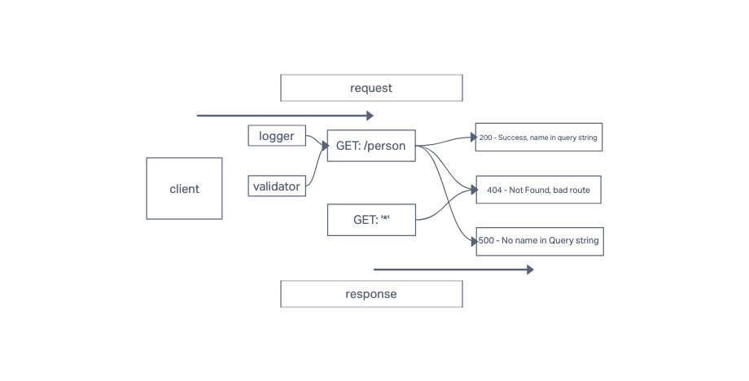

# LAB - Class 02

## Project: Basic Express Server

### Author: KC Hofstetter

### Problem Domain

From a business requirements standpoint, we will be building a basic Express server using best practices, including server modularization, use of middleware, and tests.

### Links and Resources

- [ci/cd](https://github.com/khofstetter94/basic-express-server/pull/1) (GitHub Actions)
- [back-end server url](https://kmh-basic-express-server.herokuapp.com/) (when applicable)

### Setup

- `PORT` - 3002

#### How to initialize/run your application (where applicable)

- npm start
- nodemon

#### Features / Routes

- GET: /person, Query: ?name='enter name'
- Produces an JSON object with key 'name' and value 'entered name'

#### Tests

- 404 on a bad route
- 404 on a bad method
- 500 if no name in the query string
- 200 if the name is in the query string
- given an name in the query string, the output object is correct

#### UML

